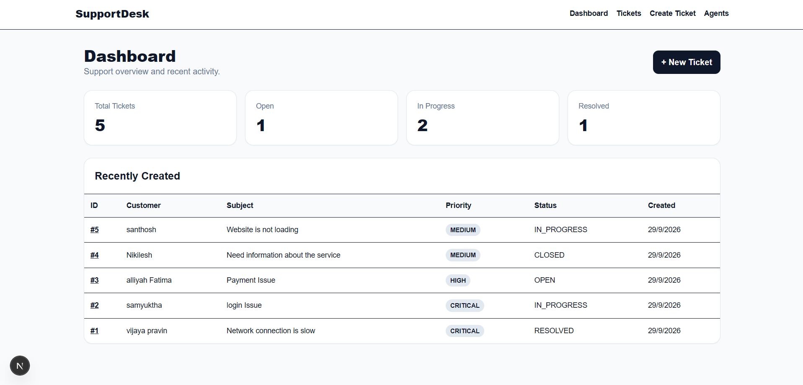
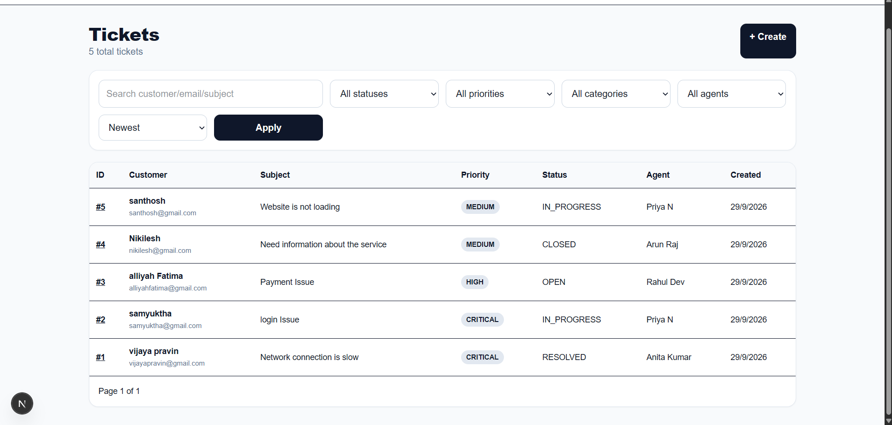
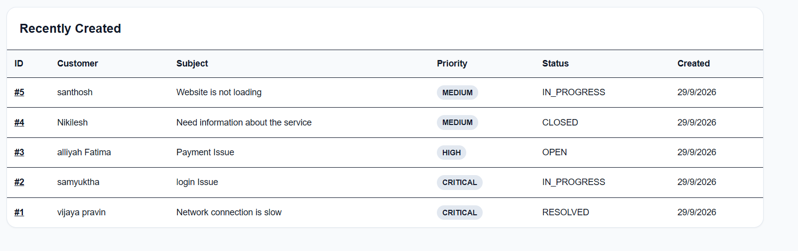
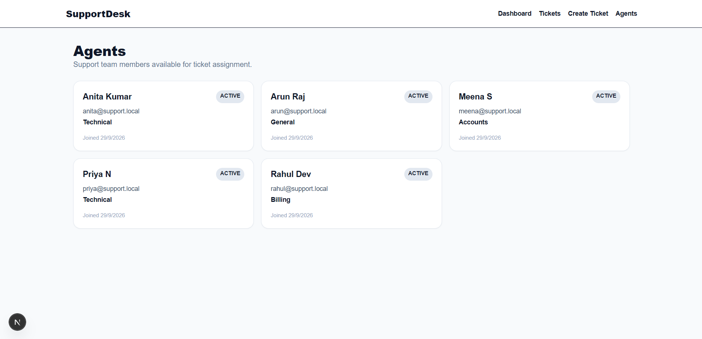

# Support Ticket Management System

A production-style 2-day full-stack intern assignment implementation using Next.js 16 App Router, TypeScript, Tailwind CSS, Express/Node.js and MySQL.

## Architecture
- `frontend/`: Next.js 16 App Router UI. API access is isolated in `lib/api.ts`.
- `backend/`: Express TypeScript REST API separated into routes, controllers, services, repositories, middleware and utilities.
- `database/database.sql`: schema, foreign keys, indexes and 5 seeded agents.

## Features
Dashboard statistics/recent tickets; ticket creation with frontend/backend validation; ticket search, filters, sorting and server pagination; ticket details; assignment; controlled status transitions; agents page; loading/error/empty states; responsive layouts.

## Requirements
Node.js 20+, npm, MySQL 8+.

## Database Setup
```bash
mysql -u root -p < database/database.sql
```

## Backend
```bash
cd backend
cp .env.example .env
# edit .env with your MySQL credentials
npm install
npm run dev
```
API: `http://localhost:4000/api`

## Frontend
```bash
cd frontend
cp .env.example .env.local
npm install
npm run dev
```
Open `http://localhost:3000`.

## Environment Variables
Backend: `PORT`, `FRONTEND_URL`, `DB_HOST`, `DB_PORT`, `DB_USER`, `DB_PASSWORD`, `DB_NAME`.
Frontend: `NEXT_PUBLIC_API_URL`.
Never commit `.env` files or credentials.

## API
- `POST /api/tickets` create ticket
- `GET /api/tickets?page=1&limit=10&search=&status=&priority=&category=&agentId=&sort=newest` list/search/filter/sort/paginate
- `GET /api/tickets/:id` details
- `PUT /api/tickets/:id` update
- `DELETE /api/tickets/:id` delete
- `PATCH /api/tickets/:id/assign` body `{ "agentId": 1 }`
- `PATCH /api/tickets/:id/status` body `{ "status": "IN_PROGRESS" }`
- `GET /api/dashboard` statistics/recent tickets
- `GET /api/agents` agents

## Status Rules
Supported forward transitions: OPEN → IN_PROGRESS/RESOLVED/CLOSED; IN_PROGRESS → RESOLVED/CLOSED; RESOLVED → CLOSED. CLOSED is final.

## Screenshots

### Dashboard


### Tickets


### Create Ticket


### Ticket Details


### Agents


## Known Limitations
Authentication, comments, activity timeline and dark mode are optional bonuses and are not included. The core mandatory requirements are prioritized.
